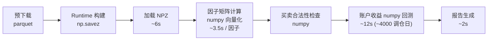

# WBR 项目说明

> 所有实施完成后，由 verify-agent 单独验收。

## 1. 核心目标
1. **数据获取模块 data/ 获取所有数据源**。回测/ga除此之外全部离线。
1. **回测速度快/回测完全离线**。
2. **回测避免任何形式上的数据泄露**，如回测使用当前股票列表（会排除历史退市）、买卖合法性检查（不同板块不同时间段规则完全不同）、因子前视检查。
3. **回测和实盘完全对齐**。策略逻辑（因子策略 topn 等）完全复用，仅实际买卖调用接口不同。并配套开发实盘回测 diff 模块，实盘期间记录所有 diff 需要的信息，盘后再跑一遍当天回测看 diff。
4、**代码精简**。项目尽量模块化复用，避免冗余代码、冗余文件。代码理论上不允许防御性编程和容错，如try\get等（除非是逻辑需要）。

## 2. 整体架构

### 2.1 数据与计算流



因子矩阵维度为 `[回测天数, 股票个数, 因子历史需要天数]`，单因子计算耗时在毫秒级。

### 2.2 红线规则
- **数据源红线（按是否联网判断）**：除 `data/update_*.py`、`data/kline_mootdx.py` 预下载入口、`trade/` 买卖模块（QMT/xtdata）外，**所有其它模块禁止任何形式的网络获取**（akshare / requests / xtdata / CNINFO 等）。NPZ + 预下载产物 parquet 均可读，因为它们不联网。
- 当前或已归档 mootdx `fq=0` OHLCVA 是常规 canonical K 线来源；Baostock primary 与 Tencent/Baidu/价格链 secondary 都只是证据快照，不得扩展成第二套日常 K 线源。
- 只有代码、日期、原始字段、单位转换、来源和总清单均被版本化封存且独立交叉核验的有限 Baostock/QMT 历史补丁可以写入明确列出的行，不得泛化成 fallback 数据源。
- **T 日价格红线（最高优先级，防数据泄露）**：信号触发、买卖合法性检查、账户成交价 **只允许使用 `open[T]`**。当日的 `high[T] / low[T] / close[T] / volume[T] / amount[T]` 全部视为前视野泄露，禁止出现在选股 / 风控 / 估值路径。需要"前收"时统一使用 `close[T-1]`。
- **因子 `calc_batch` 纯 numpy 向量化，禁止逐股票遍历**。5000+ 股票 × 20 年耗时应 < 1s，超过必有 bug。
- **离线并行边界**：GA 个体评估、彼此独立的 PPO rollout env，以及彼此独立且仅加载冻结模型的完整离线回测允许使用多进程；PPO 只允许一个 learner。每条账户时间链、三段评估编排和实盘路径必须串行。并行任务不得联网、不得跨 split 读取或拼接数据；每个 worker 的底层计算线程固定为 1，禁止嵌套并行。
- **回测/实盘对齐红线**：选股、买卖合法性检查、Top-N 排序、调仓和账户结算必须由 `env/` 提供唯一实现，回测、GA/RL 和实盘共同调用；`trade/` 只保留券商和实盘副作用，不得保留第二套领域实现。

## 3. 数据管线

### 3.1 预下载

**全量更新流程**：执行全部预下载脚本 → 下载到临时快照 → 完整性/历史不收缩校验 → 写后读回 → 原子替换正式文件。K 线增量按时间键覆盖最近窗口；禁止先删除正式 parquet 再联网，以免下载失败破坏上一份可用快照。

**原因**：实盘开盘时抓到的当日 high/low/close 只是盘中快照，收盘更新必须重拉最近窗口并按日期覆盖；其它快照也必须在新数据完整可用后才替换旧文件。

| 数据 | 来源 | 产物 |
|---|---|---|
| K线日线 · 不复权 | 当前/归档 mootdx `fq=0` OHLCVA + `xdxr()` 自算 preClose；有限历史修复按下述固定清单；primary/secondary 仅承担证据角色 | `data/k-line/{code}.parquet` |
| 股票列表 | xtdata | `data/stock_list/` |
| 退市列表 | akshare | `data/delist/` |
| 名称/ST 历史 | CNINFO API | `data/stock_name/` |
| 财务面板 | akshare | `data/financial/` |
| 股本 | akshare | `data/financial/` |
| 发行价 | akshare `stock_ipo_info` | `data/issue_price/` |

目录：`data/{k-line, runtime, db, financial, stock_list, stock_name, ...}`。

K 线下载唯一入口是 `data/kline_mootdx.py`：`update_full()` 全量、`update_recent(days)` 增量合并最近 N 个交易日；全量和增量都必须同步读取 `xdxr()` 后计算 `preClose`。

证据角色必须严格分离：Baostock primary 只验证或遮罩本地已经存在的同日 K 线，并提供 direct preClose、生命周期及 source/effective 交易状态；primary 的 `tradestatus=1` 不能创设、恢复或要求一个本地缺失日。只有带完整 schema、来源和哈希封存的 secondary exact 证据可以扩展“必须存在的可交易日期”集合，但 secondary 价格只作存在性核验，不得写入 canonical OHLCVA。

当前固定 49 行采用 6 行 archived mootdx、42 行 archived QMT 和 1 行 targeted real Baostock `adjustflag=3` 的有限分源数值契约，且每行必须同时有 secondary exact 日期确认；最后一行还必须与 Tencent 同日不复权记录交叉一致。6 行 mootdx 原始成交量按股除以 100，42 行 QMT 已是手不缩放，所有单位转换均写入版本化证据。若 secondary 已确认但固定 full-row 来源不可恢复，数据更新和 runtime 构建必须失败。所有 `normalization_applied` candidate 未获 secondary exact 确认时必须重新遮罩并 fail-closed，不得依据成交量、成交额或 primary 状态猜测。

`000508.SZ` 的官方连续停牌纠正只覆盖 `1997-03-03～1999-07-09` 的 578 个源端合成 `status=1` 日期，必须同时保留原始状态、有效状态、纠正 ID 和固定哈希；另有 16 个未确认 candidate，不属于这 578 个官方纠正。下载为空、接口失败、行政生命周期重叠或退市后无行情本身，都不能证明某日应当有 K 线或属于停牌。

### 3.2 Runtime 构建

入口：`python data/build_runtime.py`，只允许构建全历史、全股票的 `data/runtime/runtime_{start}_{end}.npz`；训练、验证、测试的日期切片统一由 `load_runtime_slice` 从该不可变快照读取，禁止在构建端裁日期或股票。

```python
np.savez_compressed('runtime_{start}_{end}.npz',
  stock_codes=np.array(U12),  trade_dates=np.array(datetime64[D]),
  open/high/low/close/volume/amount   # (n_dates, n_stocks)  原始不复权(真实价)
  preClose                             # (n_dates, n_stocks)  官方前收(除权除息参考价)
  issue_price                          # (n_stocks,)  发行价
  issue_date                           # (n_stocks,) datetime64[D]；发行价对应上市日
  st_mask                              # (n_dates, n_stocks) bool
  listing_age                          # (n_dates, n_stocks) int32；由完整历史构建，禁止按 split 重算
  delisted_mask                        # (n_dates, n_stocks) bool；退市日后首个交易日起持续为 True
  total_share                          # (n_dates, n_stocks)
  eps/roe/profit_yoy/revenue_yoy/operating_cf_ps/gross_margin  # 离线保留；当前无修订版本，不进入 actor
)
```

### 3.3 复权口径

全部使用不复权真实价。

- **常规 canonical OHLCVA 唯一源 = 当前/已归档 mootdx（腾讯通达信），一套不复权 parquet**：`data/kline_mootdx.py` 取 `fq=0` 的不复权 OHLCVA，preClose 优先由 `xdxr()` 除权除息数据按交易所公式自算。Baostock/QMT 只允许为版本化固定清单中的历史缺口提供 full-row 数值，必须逐行封存来源、原始字段、单位转换和交叉证据，禁止扩展成通用回退源；当前新增 49 行严格限定为 6 行 archived mootdx、42 行 archived QMT、1 行 targeted real Baostock，并由 secondary exact 证明日期存在。
- **收益计算用 preClose**：个股日收益 `r[t]=close[t]/preClose[t]-1`（普通日 preClose=昨收，除权日=除权参考价，已吸收分红送转配股），除权日不产生假跳空。不需要后复权价格序列。
- **涨跌停 / 合法性判断（`legality`）一律用「原始 OHLC + 官方 preClose」**：`涨停价=preClose×(1+板块涨跌幅)`、`一字板=open≥涨停价`。preClose 已是除权参考价，除权日 open/preClose 天然不假跳空——研究与实盘对账口径完全一致。
- **所有成交量/金额/市值/财务因子用原始真实价**（`TrueMarketCap`/`AmountBasedSmallCap`/`VolumeCV`/`deep_value` 及全部 `Factor_*` 等，绝对规模口径）。

## 4.策略研究指导
1、策略研究需要回测：策略研究验证必须经过回测，回测分为训练、验证、测试周期，默认使用当前ga默认的周期（基于k线有效数据长度划分的）。
2、回测周期需要多个数据源有效：如果策略实际消费多个完整输入面板，回测总周期需要以这些输入面板的时间交集为准，再划分训练、验证、测试；K 线 primary/secondary 审计证据不参与全周期交集计算。2026-09-12用户明确授权的十因子协议以逐年PIT覆盖率权衡历史长度，允许个股/个别因子缺失，采用2014～2021训练、2022～2024验证、2025～2026-08-28测试；不做完整有效股票交集，不改变缺失有效性。详见AGENTS.md第21节。
3、策略可ga搜索参数组合：使用训练周期搜索参数，验证集观察过拟合情况
4、已知错误方向：小市值低成交下的跳空因子有巨额收益，但是观察tick数据发现实际无法成交，故禁止使用隔夜跳空因子。
5、有必要可联网搜索寻找因子方向灵感、可测试多方接口数据源有效周期长度，获取更多数据，方便挖掘更多因子。

## 5. 验收命令

```bash
uv run python run_backtest --start 2024-01-01 --end 2024-12-31
```
