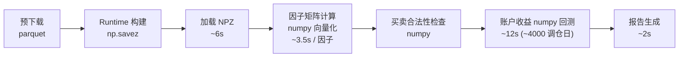

# WBR 项目说明

> 所有实施完成后，由 verify-agent 单独验收。

## 1. 核心目标

1. **回测速度要快**。因子计算全部矩阵计算。预下载模块负责所有数据源联网获取，除了买卖模块，其他任何模块数据源的网络获取是禁止的。
2. **回测避免任何形式上的数据泄露**，如回测使用当前股票列表（会排除历史退市）、买卖合法性检查（不同板块不同时间段规则完全不同）、因子前视野。
3. **回测和实盘完全对齐**。策略逻辑（因子策略 topn 等）完全复用，仅实际买卖调用接口不同。并配套开发实盘回测 diff 模块，实盘期间记录所有 diff 需要的信息，盘后再跑一遍当天回测看 diff。
4、**代码精简**。项目尽量模块化复用，避免冗余代码、冗余文件。代码理论上不允许防御性编程和容错，如try\get等（除非是逻辑需要）。

## 2. 整体架构

### 2.1 数据与计算流



因子矩阵维度为 `[回测天数, 股票个数, 因子历史需要天数]`，单因子计算耗时在毫秒级。

### 2.2 红线规则

- **数据源红线（按是否联网判断）**：除 `data/update_*.py` 预下载入口、`trading/` 买卖模块（QMT/xtdata）外，**所有其它模块禁止任何形式的网络获取**（akshare / requests / mootdx / xtdata / CNINFO 等）。NPZ + 预下载产物 parquet 均可读，因为它们不联网。
- **T 日价格红线（最高优先级，防数据泄露）**：信号触发、买卖合法性检查、账户成交价 **只允许使用 `open[T]`**。当日的 `high[T] / low[T] / close[T] / volume[T] / amount[T]` 全部视为前视野泄露，禁止出现在选股 / 风控 / 估值路径。需要"前收"时统一使用 `close[T-1]`。
- **因子 `calc_batch` 纯 numpy 向量化，禁止逐股票遍历**。5000+ 股票 × 20 年耗时应 < 1s，超过必有 bug。
- **多进程/多线程红线**：仅 `_run_ga` 中 GA 个体评估可用 `multiprocessing.Pool`。其他所有地方（因子计算、数据加载、实盘路径）禁止多进程/多线程。
- **回测/实盘对齐红线**：选股、买卖合法性检查、Top-N 排序等逻辑必须由 `core/` 提供唯一实现，回测和实盘共同调用；**禁止任何相同逻辑出现两份实现**。

## 3. 数据管线

### 3.1 预下载

**全量更新流程**：执行全部预下载脚本 → 先删光昨天 parquet → 再全量拉取到今天。

**原因**：实盘开盘时触发预下载，此时获取到的日线 close/high/low 是盘中快照而非收盘值，数据错误。因此次日必须先删除昨天的不完整数据，再重新拉取完整日线覆盖到今天。

| 数据 | 来源 | 产物 |
|---|---|---|
| K线日线 | akshare | `data/k-line/{code}.parquet` |
| 股票列表 | xtdata | `data/stock_list/` |
| 退市列表 | akshare | `data/delist/` |
| 名称/ST 历史 | CNINFO API | `data/stock_name/` |
| 财务面板 | akshare | `data/financial/` |
| 股本 | akshare | `data/financial/` |
| 发行价 | akshare `stock_ipo_info` | `data/issue_price/` |

目录：`data/{k-line, runtime, db, financial, stock_list, stock_name, ...}`。

### 3.2 Runtime 构建

入口：`python data/build_runtime.py`，产出 `data/runtime/runtime_{start}_{end}.npz`，回测时 `load_runtime_npz` 自动加载。

```python
np.savez_compressed('runtime_{start}_{end}.npz',
  stock_codes=np.array(U12),  trade_dates=np.array(datetime64[D]),
  open/high/low/close/volume/amount   # (n_dates, n_stocks)
  issue_price                          # (n_stocks,)  发行价
  st_mask                              # (n_dates, n_stocks) bool
  total_share                          # (n_dates, n_stocks)
  eps/roe/profit_yoy/revenue_yoy/operating_cf_ps/gross_margin
)
```


## 5. 验收命令

```bash
uv run python run_backtest --start 2024-01-01 --end 2024-12-31
```
